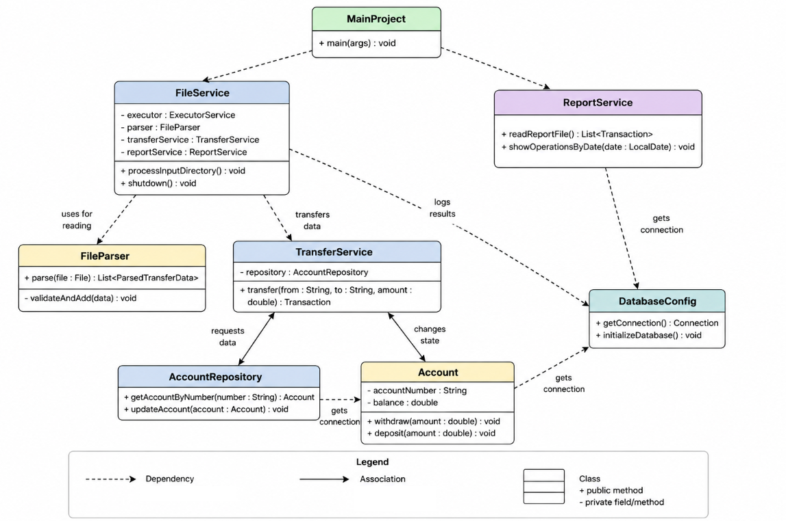

# Java Core Final Project - Money Transfer Service

## Description
This project is a console-based Java application designed to process money transfers between bank accounts. It serves as the final project for the TeachMeSkills Java Core course. The application reads transaction requests from text files, validates the data, updates account balances securely, and generates detailed execution reports.

This project implements the **Advanced Final Assignment (Version 2)** requirements, featuring concurrent file processing using multithreading and persistent data storage using a relational database.

## Features
* **Automated File Processing:** Scans an `input` directory for `.txt` files, parses the transfer requests, and automatically moves processed files to an `archive` directory.
* **Strict Data Validation:** Utilizes Regular Expressions (Regex) to ensure account numbers strictly match the `XXXXX-XXXXX` format. It also catches invalid transfer amounts and prevents processing with insufficient funds.
* **Multithreading:** Leverages `ExecutorService` to process multiple input files concurrently, significantly improving performance for bulk operations.
* **Database Integration:** Replaced in-memory data structures with an embedded **H2 Database** via JDBC for reliable, persistent storage of account balances and transaction history.
* **Detailed Reporting:** Automatically generates and updates a `report.txt` file containing the timestamp, source file name, transaction details, and operation status (Success/Error).
* **Layered Architecture:** The codebase is strictly organized into `model`, `repository`, `service`, `exception`, and `util` layers to ensure high cohesion and loose coupling.

## Technologies Used
* **Java Core** (Collections, I/O, NIO, Concurrency, Regular Expressions, Date/Time API)
* **JDBC** (Java Database Connectivity)
* **H2 Database Engine** (Embedded SQL Database)
* **Object-Oriented Programming (OOP)** principles

## Input File Format
The program expects input files to be in `.txt` format. Each transaction block must contain the following fields:

from: 12345-12345
to: 54321-54321
amount: 500

*Note: Account numbers must be exactly 10 digits separated by a hyphen.*

## Setup and Installation

1. **Clone the repository:**
   git clone https://github.com/DigitalShaten/java_core_final_project.git

2. **Open the project in your IDE:**
   Launch IntelliJ IDEA and open the cloned project folder.

3. **Configure the Database Driver:**
    * Download the H2 Database `.jar` file.
    * Add it to your project libraries (`File -> Project Structure -> Libraries -> + -> Java`).

4. **Run the Application:**
    * Locate the `MainProject` class.
    * Run the `main` method.
    * Upon the first launch, the `DatabaseConfig` utility will automatically create the local `bank_db` file and populate it with initial test accounts.

## Usage
Upon running the application, a console menu will prompt you to choose an action:
1. **Parse transfer files:** Reads all `.txt` files from the `input` directory, processes transactions, saves them to the database, and moves files to the `archive`.
2. **Read archive files:** Outputs the contents of all files currently located in the `archive` directory.
3. **View operation history:** Prompts for a date range (YYYY-MM-DD) and displays all transactions from the `report.txt` file that occurred within that period.
4. **Exit:** Safely shuts down the application and active thread pools.

## Architecture & Class Dependencies

The project follows a **Layered Architecture** pattern, ensuring a clean separation of concerns between file processing, business logic, and data persistence.

### Class Diagram
The following structure illustrates how the components interact :

* **MainProject**: The entry point that manages the user menu and orchestrates top-level service calls.
* **FileService**: The "conductor" of the system. It manages the `ExecutorService` for multithreading and coordinates the flow between parsing, transferring, and reporting.
* **FileParser**: A utility responsible for reading raw `.txt` data and converting it into structured `ParsedTransferData` objects using Regular Expressions.
* **TransferService**: Contains the core business logic. It handles transaction validation, balance updates, and exception management.
* **AccountRepository**: The Data Access Object (DAO) that interacts with the H2 Database to retrieve and update account information.
* **ReportService**: Responsible for persistent logging. It writes transaction results both to the `report.txt` file and the `transactions` database table.
* **DatabaseConfig**: Centralized configuration for JDBC connections and database initialization.

### Data Flow
1. **Input**: `FileService` detects files in the `/input` directory.
2. **Parsing**: `FileParser` extracts transaction data.
3. **Execution**: Tasks are submitted to a Thread Pool where `TransferService` processes each transaction.
4. **Persistence**: `AccountRepository` updates balances in the H2 DB, and `ReportService` logs the final status.
5. **Archiving**: The source file is moved to the `/archive` folder.

### Error Handling Strategy
The system uses a robust "Audit-First" approach. Instead of simply ignoring invalid data (e.g., negative amounts or non-existent accounts), the system captures these as `Transaction` objects with an `ERROR` status. This ensures that every attempt to move money is recorded in the final report for auditing purposes.

## Author
**Nikita Shaternik**